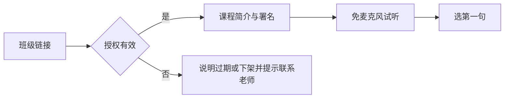
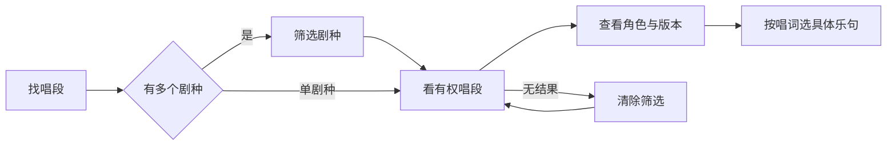
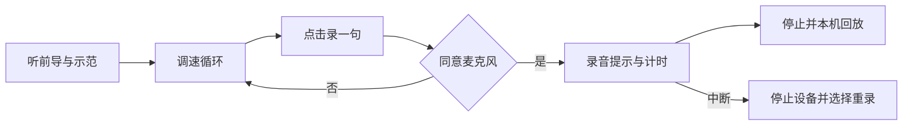
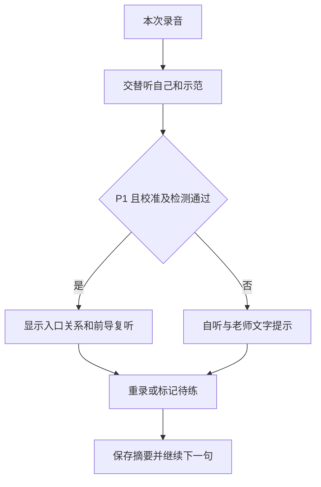
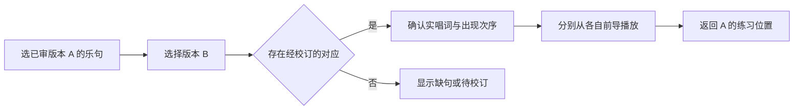
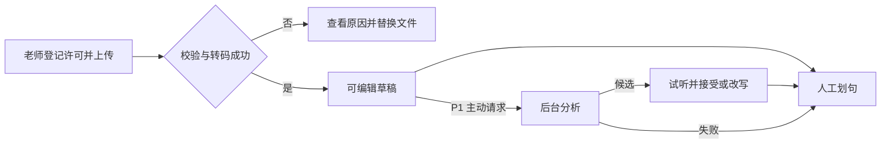
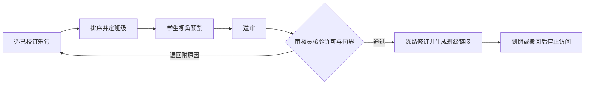

# 从第一次试听到一次课程发布

实线表示用户实际能执行的状态转换。F 编号及发布批次见[需求清单](功能与验收.md)。

## 1 首次进入

```mermaid
flowchart LR
 A[班级链接] --> B{授权有效}
 B -->|是| C[课程简介与署名] --> D[免麦克风试听] --> E[选第一句]
 B -->|否| F[说明过期或下架并提示联系老师]
```

## 2 多课程阶段的可选目录

```mermaid
flowchart LR
 A[找唱段] --> B{有多个剧种}
 B -->|是| C[筛选剧种] --> D[看有权唱段]
 B -->|单剧种| D
 D --> E[查看角色与版本] --> F[按唱词选具体乐句]
 D -->|无结果| G[清除筛选] --> D
```

## 3 开始跟唱

```mermaid
flowchart LR
 A[听前导与示范] --> B[调速循环] --> C[点击录一句]
 C --> D{同意麦克风}
 D -->|否| B
 D -->|是| E[录音提示与计时] --> F[停止并本机回放]
 E -->|中断| G[停止设备并选择重录]
```

## 4 原位对听与再练

```mermaid
flowchart TD
 A[本次录音] --> B[交替听自己和示范]
 B --> C{P1 且校准及检测通过}
 C -->|是| D[显示入口关系和前导复听]
 C -->|否| E[自听与老师文字提示]
 D --> F[重录或标记待练]
 E --> F
 F --> G[保存摘要并继续下一句]
```

## 5 同句对比（P1）

```mermaid
flowchart LR
 A[选已审版本 A 的乐句] --> B[选择版本 B]
 B --> C{存在经校订的对应}
 C -->|是| D[确认实唱词与出现次序] --> E[分别从各自前导播放]
 C -->|否| F[显示缺句或待校订]
 E --> G[返回 A 的练习位置]
```

## 6 上传及分析（手工 P0，候选 P1）

```mermaid
flowchart LR
 A[老师登记许可并上传] --> B{校验与转码成功}
 B -->|否| C[查看原因并替换文件]
 B -->|是| D[可编辑草稿]
 D --> E[人工划句]
 D -->|P1 主动请求| F[后台分析]
 F -->|候选| G[试听并接受或改写] --> E
 F -->|失败| E
```

## 7 发布练习课程

```mermaid
flowchart LR
 A[选已校订乐句] --> B[排序并定班级] --> C[学生视角预览]
 C --> D[送审] --> E{审核员核验许可与句界}
 E -->|退回附原因| A
 E -->|通过| F[冻结修订并生成班级链接]
 F --> G[到期或撤回后停止访问]
```
